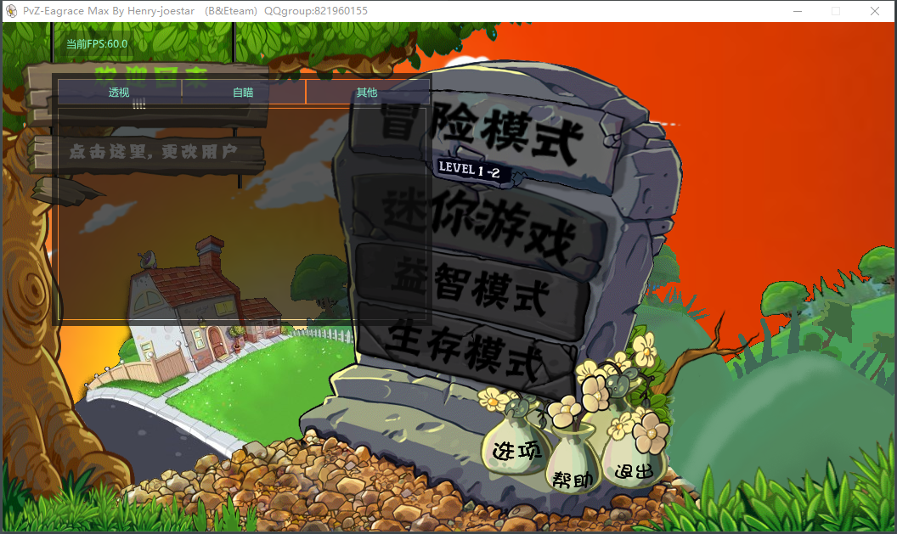
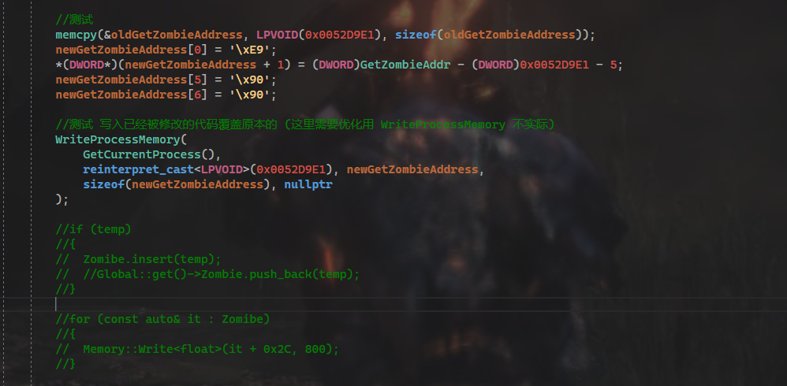

# 植物大战僵尸外部绘制

这个项目主要演示了怎么使用外部绘制ImGui

其中还用到了地址hook寄存器取值

## 已知BUG

取寄存器值待优化

## 实现功能

    注入dll创建窗口透明化 实现内部窗口绘制
    (其实可以用hook绘制实现 但游戏用的是opengl绘制,不懂怎么去hook,就用dll创建窗口的方式实现)

用inlineHook地址得到寄存器的方式取值

 
 